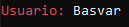
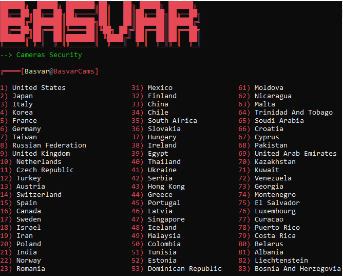

# CamTest

Herramienta de pentesting desarrollada en Python que realiza un escaneo de red en busca de cámaras de seguridad IP con configuraciones débiles o vulnerabilidades conocidas. Utiliza técnicas de reconocimiento y detección de puertos para identificar dispositivos expuestos, ayudando a evaluar riesgos y fortalecer la seguridad en entornos de red.

¿Cómo funciona?
======
Una vez iniciado el programa, debemos escribir un Usuario cualquiera es solo estetica:

Seguidamente dar **Enter** y al momento de obtener la lista completa solo queda elegir un numero:

Creador
======
Basvar, inc

basvar.com

contacto@basvar.com